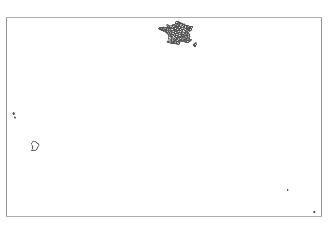
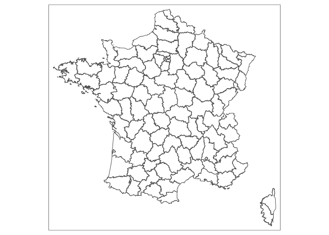

# Carte de France des prénoms
Florian Gaudin-Delrieu  
20 janvier 2017  

## Récupération des données

Les données sont en accès libre sur la plateforme [open data du gouvernement français](https://www.data.gouv.fr/fr/datasets/contours-des-departements-francais-issus-d-openstreetmap/).
Les données sont issues d'OpenStreetMap, et sont donc "© les contributeurs d'OpenStreetMap sous licence ODbL".

Les données sur les prénoms sont aussi en open source, [fournies par l'INSEE ](http://www.data.gouv.fr/fr/datasets/fichier-des-prenoms-edition-2016/).


```r
library(sp)
library(rgdal)
```

```
## rgdal: version: 1.2-5, (SVN revision 648)
##  Geospatial Data Abstraction Library extensions to R successfully loaded
##  Loaded GDAL runtime: GDAL 2.1.2, released 2016/10/24
##  Path to GDAL shared files: /usr/local/share/epsg_csv
##  Loaded PROJ.4 runtime: Rel. 4.9.1, 04 March 2015, [PJ_VERSION: 491]
##  Path to PROJ.4 shared files: (autodetected)
##  Linking to sp version: 1.2-3
```

```r
library(tmap)
library(raster)
library(stringr)
library(tidyverse)
```

```
## Loading tidyverse: ggplot2
## Loading tidyverse: tibble
## Loading tidyverse: tidyr
## Loading tidyverse: readr
## Loading tidyverse: purrr
## Loading tidyverse: dplyr
```

```
## Conflicts with tidy packages ----------------------------------------------
```

```
## extract(): tidyr, raster
## filter():  dplyr, stats
## lag():     dplyr, stats
## select():  dplyr, raster
```
 
J'ai choisi de récupérer les données de 2014 simplifiées à 100m, qui sont moins lourdes à traiter que les données de 2017 non simplifiées.


```r
france <- readOGR("departements", "departements-20140306-100m", stringsAsFactors = FALSE, use_iconv = TRUE, encoding = "iso-8859-1")
```

```
## OGR data source with driver: ESRI Shapefile 
## Source: "departements", layer: "departements-20140306-100m"
## with 101 features
## It has 4 fields
```

```r
france
```

```
## class       : SpatialPolygonsDataFrame 
## features    : 101 
## extent      : -61.80976, 55.83665, -21.38973, 51.08984  (xmin, xmax, ymin, ymax)
## coord. ref. : +proj=longlat +datum=WGS84 +no_defs +ellps=WGS84 +towgs84=0,0,0 
## variables   : 4
## names       : code_insee,      nom, nuts3,            wikipedia 
## min values  :         01,      Ain, FR101, fr:Ain (département) 
## max values  :        976, Yvelines, FR940,          fr:Yvelines
```

```r
head(france@data)
```

```
##   code_insee                     nom nuts3                  wikipedia
## 0         01                     Ain FR711       fr:Ain (département)
## 1         02                   Aisne FR221     fr:Aisne (département)
## 2         03                  Allier FR721    fr:Allier (département)
## 3         04 Alpes-de-Haute-Provence FR821 fr:Alpes-de-Haute-Provence
## 4         05            Hautes-Alpes FR822            fr:Hautes-Alpes
## 5         06         Alpes-Maritimes FR823         fr:Alpes-Maritimes
```

```r
str(france@data)
```

```
## 'data.frame':	101 obs. of  4 variables:
##  $ code_insee: chr  "01" "02" "03" "04" ...
##  $ nom       : chr  "Ain" "Aisne" "Allier" "Alpes-de-Haute-Provence" ...
##  $ nuts3     : chr  "FR711" "FR221" "FR721" "FR821" ...
##  $ wikipedia : chr  "fr:Ain (département)" "fr:Aisne (département)" "fr:Allier (département)" "fr:Alpes-de-Haute-Provence" ...
```

Essayons un premier graphique à l'aide de `tmap`


```r
tm_shape(france) +
  tm_borders()
```

<!-- -->

Avec, les départements d'outre-mer (DOM) la carte est illisible. En première approche, nous allons ignorer ces DOM. Pour les exclure, nous allons utiliser le fait que les départements de France métropolitaine sont codés sur 2 chiffres alors que les DOM sont codés sur 3 chiffres.

```r
france <- france[str_length(france$code_insee) == 2, ]
france
```

```
## class       : SpatialPolygonsDataFrame 
## features    : 96 
## extent      : -5.142238, 9.560364, 41.33323, 51.08984  (xmin, xmax, ymin, ymax)
## coord. ref. : +proj=longlat +datum=WGS84 +no_defs +ellps=WGS84 +towgs84=0,0,0 
## variables   : 4
## names       : code_insee,      nom, nuts3,            wikipedia 
## min values  :         01,      Ain, FR101, fr:Ain (département) 
## max values  :         95, Yvelines, FR832,          fr:Yvelines
```

```r
tm_shape(france) + tm_borders()
```

<!-- -->

Lisons maintenant les données des prénoms


```r
prenoms <- read_tsv("dpt2015.txt")
```

```
## Parsed with column specification:
## cols(
##   sexe = col_integer(),
##   preusuel = col_character(),
##   annais = col_character(),
##   dpt = col_character(),
##   nombre = col_double()
## )
```

```r
head(prenoms)
```

```
## # A tibble: 6 × 5
##    sexe preusuel annais   dpt nombre
##   <int>    <chr>  <chr> <chr>  <dbl>
## 1     1        A   XXXX    XX     27
## 2     1    AADEL   XXXX    XX     53
## 3     1    AADIL   1983    84      3
## 4     1    AADIL   1992    92      3
## 5     1    AADIL   XXXX    XX    162
## 6     1   AAKASH   XXXX    XX     24
```
Les données manquantes apparaissent comme `"XXXX"` pour les années de naissance, et `"XX"` pour les départements.

