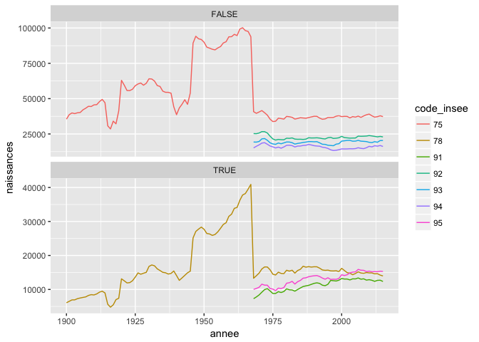

Carte de France des prénoms
================
Florian Gaudin-Delrieu
20 janvier 2017

Récupération des données
------------------------

Les données sont en accès libre sur la plateforme [open data du gouvernement français](https://www.data.gouv.fr/fr/datasets/contours-des-departements-francais-issus-d-openstreetmap/). Les données sont issues d'OpenStreetMap, et sont donc "© les contributeurs d'OpenStreetMap sous licence ODbL".

Les données sur les prénoms sont aussi en open source, [fournies par l'INSEE](http://www.data.gouv.fr/fr/datasets/fichier-des-prenoms-edition-2016/).

``` r
library(sp)
library(rgdal)
```

    ## rgdal: version: 1.2-5, (SVN revision 648)
    ##  Geospatial Data Abstraction Library extensions to R successfully loaded
    ##  Loaded GDAL runtime: GDAL 2.1.2, released 2016/10/24
    ##  Path to GDAL shared files: /usr/local/share/epsg_csv
    ##  Loaded PROJ.4 runtime: Rel. 4.9.1, 04 March 2015, [PJ_VERSION: 491]
    ##  Path to PROJ.4 shared files: (autodetected)
    ##  Linking to sp version: 1.2-3

``` r
library(tmap)
library(raster)
library(stringr)
library(tidyverse)
```

    ## Loading tidyverse: ggplot2
    ## Loading tidyverse: tibble
    ## Loading tidyverse: tidyr
    ## Loading tidyverse: readr
    ## Loading tidyverse: purrr
    ## Loading tidyverse: dplyr

    ## Conflicts with tidy packages ----------------------------------------------

    ## extract(): tidyr, raster
    ## filter():  dplyr, stats
    ## lag():     dplyr, stats
    ## select():  dplyr, raster

``` r
library(grid)
```

J'ai choisi de récupérer les données de 2014 simplifiées à 100m, qui sont moins lourdes à traiter que les données de 2017 non simplifiées.

``` r
france <- readOGR("data/original/departements", "departements-20140306-100m", stringsAsFactors = FALSE, use_iconv = TRUE, encoding = "iso-8859-1")
```

    ## OGR data source with driver: ESRI Shapefile 
    ## Source: "data/original/departements", layer: "departements-20140306-100m"
    ## with 101 features
    ## It has 4 fields

``` r
france
```

    ## class       : SpatialPolygonsDataFrame 
    ## features    : 101 
    ## extent      : -61.80976, 55.83665, -21.38973, 51.08984  (xmin, xmax, ymin, ymax)
    ## coord. ref. : +proj=longlat +datum=WGS84 +no_defs +ellps=WGS84 +towgs84=0,0,0 
    ## variables   : 4
    ## names       : code_insee,      nom, nuts3,            wikipedia 
    ## min values  :         01,      Ain, FR101, fr:Ain (département) 
    ## max values  :        976, Yvelines, FR940,          fr:Yvelines

``` r
head(france@data)
```

    ##   code_insee                     nom nuts3                  wikipedia
    ## 0         01                     Ain FR711       fr:Ain (département)
    ## 1         02                   Aisne FR221     fr:Aisne (département)
    ## 2         03                  Allier FR721    fr:Allier (département)
    ## 3         04 Alpes-de-Haute-Provence FR821 fr:Alpes-de-Haute-Provence
    ## 4         05            Hautes-Alpes FR822            fr:Hautes-Alpes
    ## 5         06         Alpes-Maritimes FR823         fr:Alpes-Maritimes

``` r
str(france@data)
```

    ## 'data.frame':    101 obs. of  4 variables:
    ##  $ code_insee: chr  "01" "02" "03" "04" ...
    ##  $ nom       : chr  "Ain" "Aisne" "Allier" "Alpes-de-Haute-Provence" ...
    ##  $ nuts3     : chr  "FR711" "FR221" "FR721" "FR821" ...
    ##  $ wikipedia : chr  "fr:Ain (département)" "fr:Aisne (département)" "fr:Allier (département)" "fr:Alpes-de-Haute-Provence" ...

*Note :* Pour ne plus avoir le message d'erreur `NOTE: rgdal::checkCRSArgs: no proj_defs.dat in PROJ.4 shared files`, j'ai fait comme indiqué à [cette adresse](https://gis.stackexchange.com/questions/224467/raster-error-note-rgdalcheckcrsargs-no-proj-defs-dat-in-proj-4-shared-file)'

Essayons un premier graphique à l'aide de `tmap`

``` r
tm_shape(france) +
  tm_borders()
```


Avec, les départements d'outre-mer (DOM) la carte est illisible. En première approche, nous allons ignorer ces DOM. Pour les exclure, nous allons utiliser le fait que les départements de France métropolitaine sont codés sur 2 chiffres alors que les DOM sont codés sur 3 chiffres.

``` r
france <- france[str_length(france$code_insee) == 2, ]
france
```

    ## class       : SpatialPolygonsDataFrame 
    ## features    : 96 
    ## extent      : -5.142238, 9.560364, 41.33323, 51.08984  (xmin, xmax, ymin, ymax)
    ## coord. ref. : +proj=longlat +datum=WGS84 +no_defs +ellps=WGS84 +towgs84=0,0,0 
    ## variables   : 4
    ## names       : code_insee,      nom, nuts3,            wikipedia 
    ## min values  :         01,      Ain, FR101, fr:Ain (département) 
    ## max values  :         95, Yvelines, FR832,          fr:Yvelines

``` r
tm_shape(france) + tm_borders()
```


Lisons maintenant les données des prénoms. L'encodage doit être précisé pour les lettres accentuées.

``` r
prenoms <- read_tsv("data/original/dpt2015.txt", locale = locale(encoding = "iso-8859-1"))
```

    ## Parsed with column specification:
    ## cols(
    ##   sexe = col_integer(),
    ##   preusuel = col_character(),
    ##   annais = col_character(),
    ##   dpt = col_character(),
    ##   nombre = col_double()
    ## )

``` r
head(prenoms)
```

    ## # A tibble: 6 × 5
    ##    sexe preusuel annais   dpt nombre
    ##   <int>    <chr>  <chr> <chr>  <dbl>
    ## 1     1        A   XXXX    XX     27
    ## 2     1    AADEL   XXXX    XX     53
    ## 3     1    AADIL   1983    84      3
    ## 4     1    AADIL   1992    92      3
    ## 5     1    AADIL   XXXX    XX    162
    ## 6     1   AAKASH   XXXX    XX     24

Les données manquantes apparaissent comme `"XXXX"` pour les années de naissance, et `"XX"` pour les départements.

``` r
table(prenoms$dpt == "XX") # Moins de 1% des départements sont manquants
```

    ## 
    ##   FALSE    TRUE 
    ## 3372275   33036

``` r
table(prenoms$annais == "XXXX") # Il y a exactement le même nombre d'années de naissance manquantes
```

    ## 
    ##   FALSE    TRUE 
    ## 3372275   33036

``` r
nrow(filter(prenoms, dpt == "XX", annais != "XXXX")) # Toutes les données manquantes sont sur les mêmes lignes
```

    ## [1] 0

Les données manquantes étant sur les mêmes lignes, nous allons les supprimer, puisque nous ne pouvons pas les placer par département. Nous allons renommer les variables pour des noms moins obscurs, et nous changeons le département en code\_insee, pour pouvoir joindre les données avec la carte plus facilement.

``` r
prenoms <- prenoms %>% 
  rename(prenom = preusuel, annee = annais, code_insee = dpt) %>% 
  mutate(sexe = factor(sexe, levels = c(1, 2), labels = c("M", "F")),
         annee = as.integer(annee)) %>% 
  filter(annee != "XXXX")
```

    ## Warning in eval(substitute(expr), envir, enclos): NAs introduits lors de la
    ## conversion automatique

``` r
head(prenoms)
```

    ## # A tibble: 6 × 5
    ##     sexe prenom annee code_insee nombre
    ##   <fctr>  <chr> <int>      <chr>  <dbl>
    ## 1      M  AADIL  1983         84      3
    ## 2      M  AADIL  1992         92      3
    ## 3      M  AARON  1962         75      3
    ## 4      M  AARON  1982         75      3
    ## 5      M  AARON  1984         75      3
    ## 6      M  AARON  1985         75      4

Carte pour un prénom, toutes années confondues
----------------------------------------------

Essayons de résumer les données pour un prénom (par exemple `"Florian"`), toutes années confondues

``` r
florian <- prenoms %>% 
  filter(prenom == "FLORIAN") %>% 
  group_by(code_insee) %>% 
  summarise(total = sum(nombre))
```

``` r
tm_shape(sp::merge(france, florian)) +
  tm_borders() +
  tm_fill(col = "total")
```


Il y a de nombreux Florian dans le Nord, intéressant ! La Corse est manquante, cela doit venir du fait que les départements sont 2A et 2B, et doivent être marqués comme 20 dans un des deux jeux de données, ce qui fait que la jointure ne marche pas.

``` r
setdiff(unique(france$code_insee), unique(prenoms$code_insee)) # Il n'y a bien que la Corse qui pose problème
```

    ## [1] "2A" "2B"

Changeons les départements dans prenoms pour que la jointure soit la bonne.

``` r
prenoms_corse <- prenoms %>% 
  filter(code_insee == "20") %>% 
  mutate(code_insee = "2B", nombre = nombre / 2)


prenoms$code_insee[prenoms$code_insee == "20"] <- "2A"
prenoms$nombre[prenoms$code_insee == "2A"] <- prenoms$nombre[prenoms$code_insee == "2A"] / 2
prenoms <- prenoms %>% bind_rows(prenoms_corse) 

florian2 <- prenoms %>% 
  filter(prenom == "FLORIAN") %>% 
  group_by(code_insee) %>% 
  summarise(total = sum(nombre))

# Contrôle rapide
setdiff(florian2, florian)
```

    ## # A tibble: 2 × 2
    ##   code_insee total
    ##        <chr> <dbl>
    ## 1         2A 192.5
    ## 2         2B 192.5

Refaisons la carte

``` r
tm_shape(sp::merge(france, florian2)) +
  tm_borders() +
  tm_fill(col = "total")
```


On ne voit pas bien la région parisienne.

``` r
paris <- france[france$code_insee %in% c("75", "92", "93", "94"), ]
tm_shape(sp::merge(paris, florian2))+
  tm_borders() +
  tm_fill(col = "total", breaks = seq(0, 7000, by = 1000))
```


J'ai modifié la légende manuellement pour avoir la même que sur la carte de toute la France.

Autre approche pour les graphes
-------------------------------

Plutôt que de supprimer les données, peut être est-il utile de "facetter" les régions que l'on ne voit pas (DOM et région parisienne) ?

``` r
france2 <- readOGR("data/original/departements", "departements-20140306-100m", stringsAsFactors = FALSE, use_iconv = TRUE, encoding = "iso-8859-1")
```

    ## OGR data source with driver: ESRI Shapefile 
    ## Source: "data/original/departements", layer: "departements-20140306-100m"
    ## with 101 features
    ## It has 4 fields

``` r
france2$facet <- "Métropole"
france2$facet[france2$code_insee %in% c(c("75", "92", "93", "94"))] <- "Paris"
france2$facet[str_length(france2$code_insee) > 2] <- str_sub(france2$wikipedia[str_length(france2$code_insee) > 2], 4) 

tm_shape(france2) +
  tm_borders() +
  tm_facets("facet", free.coords = TRUE)
```


Ce n'est pas très satisfaisant, la métropole est beaucoup trop petite par rapport au reste. On pourrait partir sur 2 graphes : un pour la métropole et un pour les autres sous forme de facettes.

``` r
france_metro <- france2[france2$facet == "Métropole", ]
france_autre <- france2[france2$facet != "Métropole", ]

p1 <- tm_shape(france_metro) +
  tm_borders()
p2 <- tm_shape(france_autre) +
  tm_borders() +
  tm_facets("facet", free.coords = TRUE, ncol = 1)

grid.newpage()
pushViewport(viewport(layout=grid.layout(nrow = 1, ncol = 2, widths = unit(c(0.8, 0.2), "npc"))))
print(p1, vp=viewport(layout.pos.col = 1))
print(p2, vp=viewport(layout.pos.col = 2))
```


Ce n'est pas trop mal. Testons avec les prénoms

``` r
sort(unique(prenoms$code_insee))
```

    ##  [1] "01" "02" "03" "04" "05" "06" "07" "08" "09" "10" "11" "12" "13" "14"
    ## [15] "15" "16" "17" "18" "19" "21" "22" "23" "24" "25" "26" "27" "28" "29"
    ## [29] "2A" "2B" "30" "31" "32" "33" "34" "35" "36" "37" "38" "39" "40" "41"
    ## [43] "42" "43" "44" "45" "46" "47" "48" "49" "50" "51" "52" "53" "54" "55"
    ## [57] "56" "57" "58" "59" "60" "61" "62" "63" "64" "65" "66" "67" "68" "69"
    ## [71] "70" "71" "72" "73" "74" "75" "76" "77" "78" "79" "80" "81" "82" "83"
    ## [85] "84" "85" "86" "87" "88" "89" "90" "91" "92" "93" "94" "95" "97"

Le problème est que les DOM ne sont pas détaillés dans le fichier prenoms : ils sont tous indiqués comme 97. On pourrait diviser en 5 le nombre donné dans le fichier, mais ça aurait bien moins de sens que pour la Corse, vu la diversité des territoires.

``` r
france_autre <- france2[france2$facet == "Paris", ]

p3 <- tm_shape(sp::merge(france_metro, florian2)) +
  tm_borders() +
  tm_fill(col = "total")
p4 <- tm_shape(sp::merge(france_autre, florian2)) +
  tm_borders() +
  tm_fill(col = "total")

grid.newpage()
pushViewport(viewport(layout=grid.layout(nrow = 1, ncol = 2, widths = unit(c(0.8, 0.2), "npc"))))
print(p3, vp=viewport(layout.pos.col = 1))
print(p4, vp=viewport(layout.pos.col = 2))
```


Bon, cette approche n'est pas très concluante. Je vais plutôt faire une seule carte avec toute la France métropolitaine, sans les DOM, et sans "zoom" sur la région parisienne.

Proportion de naissances
------------------------

Le fait de dessiner le nombre de naissances donnera le plus souvent une carte des populations et ne nous renseignera pas sur la particularité d'un prénom. Donc au lieu de remplir en fonction du nombre de naissances, nous allons le faire en fonction du pourcentage de naissance de ce prénomn, dans chaque département.

``` r
naissances <- prenoms %>% 
  group_by(code_insee) %>% 
  summarise(naissances = sum(nombre))

florian3 <- inner_join(florian2, naissances, by = "code_insee") %>% 
  mutate(prop = total / naissances)

tm_shape(sp::merge(france, florian3)) +
  tm_borders(alpha = 0.5) +
  tm_fill("prop")
```


La carte est très différente de la première version ! Le Nord disparaît, et on voit une concentration dans la région Sud-Est, ainsi qu'un gros pic en région parisienne (hors Paris qui est quasiment blanc).

``` r
florian3 %>% arrange(-prop) %>% head(10)
```

    ## # A tibble: 10 × 4
    ##    code_insee total naissances        prop
    ##         <chr> <dbl>      <dbl>       <dbl>
    ## 1          91  2309     538596 0.004287072
    ## 2          95  2324     629388 0.003692476
    ## 3          94  2463     760356 0.003239272
    ## 4          84  1466     537252 0.002728701
    ## 5          83  1817     679807 0.002672817
    ## 6          92  2891    1089192 0.002654261
    ## 7          93  2249     918799 0.002447761
    ## 8          06  1881     782180 0.002404817
    ## 9          77  2118     892659 0.002372687
    ## 10         74  1480     628855 0.002353484

On voit que la région parisienne (hors Paris) est dans le top 10. Je suis curieux de voir ce qui s'est passé dans le Nord (pourquoi n'est-il plus dans le top des proportions alors que c'était le département avec le plus de naissances en valeur absolue).

``` r
naissances_annees <- prenoms %>% 
  group_by(code_insee, annee) %>% 
  summarise(naissances = sum(nombre)) %>% 
  ungroup()

prenoms %>% 
  filter(prenom == "FLORIAN", code_insee %in% c("59", "92")) %>%
  inner_join(naissances_annees, by = c("code_insee", "annee")) %>% 
  ggplot(aes(annee)) + 
    geom_line(aes(y = naissances, col = code_insee))
```


Voilà l'explication ! Il n'y a pas de données pour certains départements avant environ 1970, alors que pour d'autres il y a des données depuis 1900. Cela fausse donc le total et les proportions.

``` r
prenoms %>% 
  group_by(code_insee) %>% 
  summarise(debut = min(annee)) %>% 
  arrange(-debut) %>% 
  head(10)
```

    ## # A tibble: 10 × 2
    ##    code_insee debut
    ##         <chr> <int>
    ## 1          91  1968
    ## 2          92  1968
    ## 3          93  1968
    ## 4          94  1968
    ## 5          95  1968
    ## 6          01  1900
    ## 7          02  1900
    ## 8          03  1900
    ## 9          04  1900
    ## 10         05  1900

En fait les départements de la courronne parisienne ont été créés en 1968, cela explique donc l'absence de données rétroactives. D'après [la page wikipedia](https://fr.wikipedia.org/wiki/R%C3%A9organisation_de_la_r%C3%A9gion_parisienne_en_1964), les départements de la Seine (remplacé par ceux de Paris, des Hauts-de-Seine, de la Seine-Saint-Denis, et du Val-de-Marne) et de Seine-et-Oise (remplacé par ceux de l'Essonne, des Yvelines, et du Val-d'Oise) ont été supprimés.

### Création d'un historique

Regardons l'historique des naissances pour Paris et la région parisienne.

``` r
ggplot(naissances_annees %>% 
         filter(code_insee %in% c("75", "78", "91", "92", "93", "94", "95")) %>% 
         mutate(groupe = code_insee %in% c("78", "91", "95")), 
       aes(x = annee, y = naissances, color = code_insee)) + 
  geom_line() +
  facet_wrap(~ groupe, scales = "free_y", ncol = 1)
```



Nous allons faire un faux historique pour ces départements, à partir d'une proportion des départements de Paris et des Yvelines.

``` r
prop_seine <- naissances_annees %>% 
  filter(code_insee %in% c("75", "92", "93", "94"),
         annee >= 1968) %>% 
  group_by(code_insee) %>% 
  summarise(total = sum(naissances)) %>% 
  mutate(prop = total/ sum(total)) %>% 
  select(-total)

naissances_recalculees <- naissances_annees %>% 
  filter(code_insee == "75",
         annee < 1968) %>% 
  complete(annee, code_insee = c("75", "92", "93", "94")) %>% 
  fill(naissances) %>% 
  inner_join(prop_seine, by = "code_insee") %>% 
  mutate(naissances = prop * naissances) %>% 
  select(-prop)

naissances_paris <- naissances_annees %>% 
  filter(annee >= 1968, code_insee %in% c("75", "92", "93", "94")) %>% 
  bind_rows(naissances_recalculees)

# Vérification
setequal(naissances_paris %>%
          group_by(annee) %>% 
          summarise(total = sum(naissances)),
        naissances_annees %>% 
          filter(code_insee %in% c("75", "92", "93", "94")) %>% 
          group_by(annee) %>% 
          summarise(total = sum(naissances)))
```

    ## TRUE

``` r
ggplot(naissances_paris, aes(annee, naissances)) +
  geom_line(aes(color = code_insee)) +
  geom_vline(xintercept = 1968)
```


La vérification fonctionne et le graphe est plutôt cohérent. Faisons de même pour l'ancienne Seine-et-Oise et recalculons le jeux de `naissances_annees`. *Note :* Pour calculer la répartition de la population, je me suis basé sur la période de 1968 à 1998, vu que la répartition change après les années 2000 (les naissances augmentent beaucoup dans le Val d'Oise alors qu'elles diminuent dans les Yvelines).

``` r
prop_oise <- naissances_annees %>% 
  filter(code_insee %in% c("78", "91", "95"),
         annee >= 1968, annee <= 1998) %>% 
  group_by(code_insee) %>% 
  summarise(total = sum(naissances)) %>% 
  mutate(prop = total/ sum(total)) %>% 
  select(-total)

naissances_recalculees2 <- naissances_annees %>% 
  filter(code_insee == "78",
         annee < 1968) %>% 
  complete(annee, code_insee = c("78", "91", "95")) %>% 
  fill(naissances) %>% 
  inner_join(prop_oise, by = "code_insee") %>% 
  mutate(naissances = prop * naissances) %>% 
  select(-prop)

naissances_oise <- naissances_annees %>% 
  filter(annee >= 1968, code_insee %in% c("78", "91", "95")) %>% 
  bind_rows(naissances_recalculees2)

# Vérification 
setdiff(naissances_oise %>%
          group_by(annee) %>% 
          summarise(total = sum(naissances)),
        naissances_annees %>% 
          filter(code_insee %in% c("78", "91", "95")) %>% 
          group_by(annee) %>% 
          summarise(total = sum(naissances)))
```

    ## # A tibble: 0 × 2
    ## # ... with 2 variables: annee <int>, total <dbl>

``` r
ggplot(naissances_oise, aes(annee, naissances)) +
  geom_line(aes(color = code_insee)) +
  geom_vline(xintercept = c(1968, 1998))
```


On voit une chute en 1968 que l'on n'observe pas sur le graphe de Paris. La répartition de la population des YVelines avant et après la séparation des départements ne doit pas être exacte, mais dans l'ensemble, l'interpolation ne semble pas trop mauvaise.

### Nouveau jeu de données prénoms

Créons le jeu de données `naissances` dans une version qui fonctionne pour biennous, c'est à dire :

-   Prenant en compte la Corse en tant que 2 départements ;
-   Sans les données des DOM, trop difficiles à interpoler ;
-   Recréant un historique pour les départements de la région parisienne ;
-   Avec des noms de colonne plus simples.

``` r
exclure <- tibble(code_insee = c("75", "78", "91", "92", "93", "94", "95", "97"))

naissances_histo <- naissances_annees %>% 
  anti_join(exclure, by = "code_insee") %>% 
  bind_rows(naissances_paris, naissances_oise)

# Vérification
t1 <- naissances_histo %>%
  group_by(code_insee) %>% 
  summarise(naissances = sum(naissances))

t2 <- naissances %>% 
  filter(code_insee != "97")

setdiff(t1, t2) # Il n'y a que la région parisienne
```

    ## # A tibble: 7 × 2
    ##   code_insee naissances
    ##        <chr>      <dbl>
    ## 1         75  3458175.3
    ## 2         78  1230337.7
    ## 3         91   865536.7
    ## 4         92  2110400.1
    ## 5         93  1780249.5
    ## 6         94  1473253.0
    ## 7         95  1012197.6

``` r
# Vérifions que les totaux sont les bons

setequal(t1 %>% 
          group_by(code_insee %in% c("78", "91", "95")) %>%
          summarise(total = sum(naissances)),
        t2 %>% 
          group_by(code_insee %in% c("78", "91", "95")) %>%
          summarise(total = sum(naissances)))
```

    ## TRUE

``` r
# write_csv(naissances_histo, "data/recalc/naissances.csv")
```

En fait, pour avoir des résultats cohérents, il faudrait aussi refaire l'historique pour chaque prénom des départements 75 et 78 avant 1968. Comme cela va me faire copier/coller plus de 2 fois, il est temps de faire une fonction. Pour les prénoms, il faut aussi prendre en compte le sexe, puisque certains prénoms sont mixtes. Il ne faut pas ajouter systématiquement les deux sexes, c'est pourquoi j'utilise `nesting` à l'intérieur de `complete` pour ne completer que les cas où les données sont présentes.

``` r
modifier_historique_prenoms <- function(data, code_avant, codes_apres, annee_limite, props){
  avant <- data %>% 
    filter(code_insee == code_avant,
           annee < annee_limite) %>% 
    complete(nesting(annee, prenom, sexe), code_insee = codes_apres) %>% 
    fill(nombre) %>% 
    inner_join(props, by = "code_insee") %>%
    mutate(nombre = prop * nombre) %>%
    select(-prop)
  
  apres <- data%>% 
    filter(annee >= annee_limite,
           code_insee %in% codes_apres)
  
  data %>% 
    anti_join(tibble("code_insee" = codes_apres), by = "code_insee") %>% 
    bind_rows(avant, apres) %>% 
    arrange(annee, code_insee, sexe, prenom)
}

modifier_historique_prenoms(prenoms %>% filter(prenom == "CLAUDE"),
                            code_avant = "78",
                            codes_apres = c("78", "91", "95"),
                            annee_limite = 1968,
                            props = prop_oise)
```

    ## # A tibble: 10,602 × 5
    ##      sexe prenom annee code_insee nombre
    ##    <fctr>  <chr> <int>      <chr>  <dbl>
    ## 1       M CLAUDE  1900         01     41
    ## 2       M CLAUDE  1900         03     44
    ## 3       M CLAUDE  1900         13     12
    ## 4       M CLAUDE  1900         17      4
    ## 5       M CLAUDE  1900         21      9
    ## 6       M CLAUDE  1900         25      6
    ## 7       M CLAUDE  1900         26      3
    ## 8       M CLAUDE  1900         29     12
    ## 9       M CLAUDE  1900         38      8
    ## 10      M CLAUDE  1900         39      8
    ## # ... with 10,592 more rows

``` r
modifier_historique_oise <- function(data){
  prop_oise <-tibble("code_insee" = c("78", "91", "95"),
                     "prop" = c(0.4105975, 0.2715035, 0.3178990))
  modifier_historique_prenoms(data, code_avant = "78",
                              codes_apres = prop_oise$code_insee,
                              annee_limite = 1968,
                              props = prop_oise)
}  

modifier_historique_seine <- function(data){
  prop_seine <- tibble("code_insee" = c("75", "92", "93", "94"),
                       "prop" = c(0.3919910, 0.2392180, 0.2017948, 0.1669961))
  modifier_historique_prenoms(data, code_avant = "75",
                              codes_apres = prop_seine$code_insee,
                              annee_limite = 1968,
                              props = prop_seine)
}

modifier_historique_corse <- function(data){
  prop_corse <- tibble("code_insee" = c("20", "2A", "2B"),
                       "prop" = c(0, 0.5, 0.5))
  modifier_historique_prenoms(data, code_avant = "20",
                              codes_apres = prop_corse$code_insee,
                              annee_limite = 9999,
                              props = prop_corse) %>% 
    filter(nombre != 0)
}

modifier_historique_tous <- . %>% 
  modifier_historique_corse() %>% 
  modifier_historique_oise() %>% 
  modifier_historique_seine()
```

Reprenons maintenant depuis le début

``` r
prenoms_recalcules <- read_tsv("data/original/dpt2015.txt", locale = locale(encoding = "iso-8859-1")) %>%
  rename(prenom = preusuel, annee = annais, code_insee = dpt) %>% 
  mutate(sexe = factor(sexe, levels = c(1, 2), labels = c("M", "F")),
         annee = as.integer(annee)) %>% 
  filter(annee != "XXXX",
         code_insee != "97") %>%  
  modifier_historique_tous
```

    ## Parsed with column specification:
    ## cols(
    ##   sexe = col_integer(),
    ##   preusuel = col_character(),
    ##   annais = col_character(),
    ##   dpt = col_character(),
    ##   nombre = col_double()
    ## )

    ## Warning in eval(substitute(expr), envir, enclos): NAs introduits lors de la
    ## conversion automatique

``` r
inner_join(prenoms %>% 
             filter(code_insee != "97") %>% 
             group_by(annee) %>% 
             summarise(total = sum(nombre)),
           prenoms_recalcules %>% 
             group_by(annee) %>% 
             summarise(total_recalc = sum(nombre)),
           by = "annee") %>% 
  mutate(diff = total_recalc - total) %>% 
  summarise(err = mean(diff))
```

    ## # A tibble: 1 × 1
    ##            err
    ##          <dbl>
    ## 1 -0.003680123

On a en moyenne une erreur de -0.004 naissance par an, qui doit provenir des erreurs d'arrondi au niveau des proportions. Cela me paraît satisfaisant, je vais sauvegarder le jeu de données pour pouvoir le réutiliser sans avoir à tout refaire. Nous pouvons maintenant refaire de nouveau la carte. Pour avoir le jeu de données spécifique au prénom, je vais refaire une fonction, vu que je vais copier/coller pour la 3eme fois. Je vais aussi rajouter la possibilité de choisir des dates pour lesquelles faire les proportions.

``` r
# write_csv(prenoms_recalcules, "data/recalc/prenoms_recalcules.csv")

calculer_prop <- function(Prenom, debut = 1900, fin = 2015){
  naissances_filtre <- naissances_histo %>% 
    filter(between(annee, debut, fin)) %>% 
    group_by(code_insee) %>% 
    summarise(naissances = sum(naissances))
  
  prenoms_recalcules %>%
    filter(prenom == str_to_upper(Prenom),
           between(annee, debut, fin)) %>%
    group_by(code_insee) %>%
    summarise(total = sum(nombre)) %>%
    inner_join(naissances_filtre, by = "code_insee") %>%
    mutate(prop = total/naissances * 100)
}
```

En fait, il existe un mode interactif dans `tmap`, qui permet de zoomer. Cela sera mieux pour voir la région parisienne en particulier, et permet de faire apparaître les chifres aussi.

``` r
# tmap_mode("view")

creer_carte <- function(Prenom, debut = 1900, fin = 2015){
  data <- sp::merge(france, calculer_prop(Prenom, debut, fin))
  data$nom_dept <- str_c(data$nom, data$code_insee, sep = ", ")
  tm_shape(data) +
    tm_borders(alpha = 0.5) +
    tm_fill(col = "prop", 
            id = "nom_dept", 
            textNA = "Aucune",
            title = "En %",
            popup.vars = c("total", "prop"),
            legend.format = list(text.separator = "à")) +
    tm_view(set.zoom.limits = c(5, 9), legend.position = c("left", "bottom")) +
    tm_layout(title = str_c(str_to_title(Prenom), " entre ", debut, " et ", fin))
}

creer_carte("roger", 1950, 2000)
```


