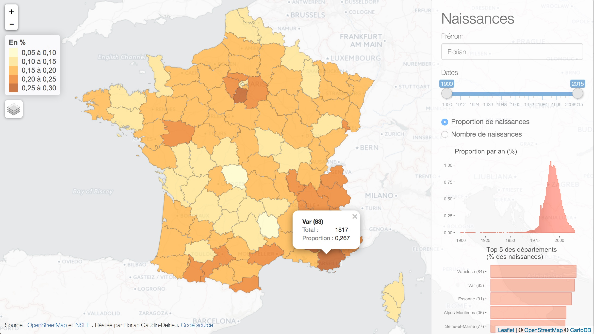

# CartePrenoms

Le but est de fournir une carte de France des naissances pour un prénom donné, par département.

## Données
Les données proviennet de la plateforme [open data du gouvernement français](https://www.data.gouv.fr/fr/datasets/contours-des-departements-francais-issus-d-openstreetmap/).
Les données sont issues d'OpenStreetMap, et sont donc "© les contributeurs d'OpenStreetMap sous licence ODbL".
Les données sur les prénoms sont aussi en open source, [fournies par l'INSEE ](http://www.data.gouv.fr/fr/datasets/fichier-des-prenoms-edition-2016/). Elles concernent les naissances en France depuis 1900.

Ces données ont été modifiées pour permettre une meilleure visualisation. En particulier, les données cartographiques des DOM et Mayotte ont été supprimées, les données des prénoms concernant la Corse ont été séparées en 2 (pour chaque département), et un historique a été créé pour les départements de la région parisienne créés en 1968.

## Carte
La carte a été créée sous R à partir du package `tmap`. Le package `leaflet` a servi à l'intégration dans l'application Shiny.

L'application en elle même a été fortement inspirée par la carte [SuperZip Example](http://shiny.rstudio.com/gallery/superzip-example.html) par RStudio, dont le code sur trouve [ici](https://github.com/rstudio/shiny-examples/tree/master/063-superzip-example).

## Fonctionnement
Le prénom saisi est cherché dans la base de données. S'il n'est pas trouvé, un message d'erreur apparaît (peut être amélioré, pour l'instant l'erreur apparaît telle qu'elle et le message n'est pas très significatif). Il est possible de faire bouger le curseur pour choisir un intervalle sur lequel faire les statistique. Les boutons radio permettent de basculer entre un affichage du pourcentage de naissance par département ayant ce prénom et le nombre de naissances par département ayant ce prénom.

## Améliorations
On pourrait améliorer la gestion de l'erreur si une recherche ne donne pas de résultats.
L'information disponible sur les popup pourrait être améliorée, mais je n'ai pas trouvé comment modifier les noms des variables (autrement qu'en renommant le fichier de données), ou comment utiliser `leaflet::addPopups` après avoir créé les popups dans `tmap::tm_fill`.
La carte pourrait être mieux centrée à l'ouverture.

N'hésitez pas à réutiliser ces données !
